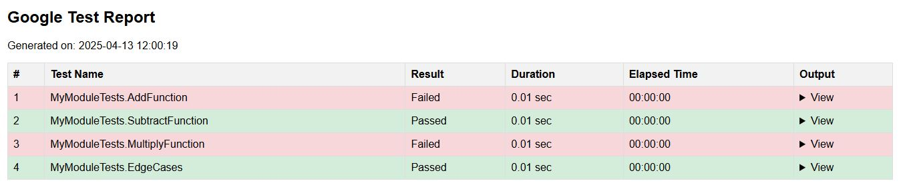

# GoogleTest Setup and Usage Guide

This guide provides step-by-step instructions to set up and run GoogleTest (GTest) on your local system.

---

## Prerequisites

1. **Operating System**: Compatible with Linux, macOS, or Windows. This setup is done according to windows OS.
2. **C++ Compiler**: Ensure you have a compiler that supports at least **C++14**.
   - Examples: MSVC.
3. **Build System**: Install **CMake** (minimum version 3.16).
   - [Download CMake](https://cmake.org/download/).
4. **Python**: Required for some GoogleTest tests (optional for basic usage).
   - [Download Python](https://www.python.org/downloads/).

---

## Steps to Set Up and Run GoogleTest

### 1. Clone the Repository
```sh
git clone https://github.com/shamim-iq/CI-CD-for-GTest.git
cd P1
```

### 2. Download the GoogleTest repository to your local system:
```sh
git clone https://github.com/google/googletest.git
```

### 3. Create the build directory:
```sh
mkdir build
cd build
```

### 4. Debug and test:
```sh
cmake .. -DCMAKE_BUILD_TYPE=Debug
cd ..
cmake --build .                                                                   
ctest --verbose                                                                         
```

### 5. Convert the logs into human-readable format
```sh
cd ../..
echo "" > gtest_report.html
python .\Log_parser_html.py
```
### 6. Access the "gtest_report.html" in a browser tab and monitor the logs.
<div align="center">
  
</div>

